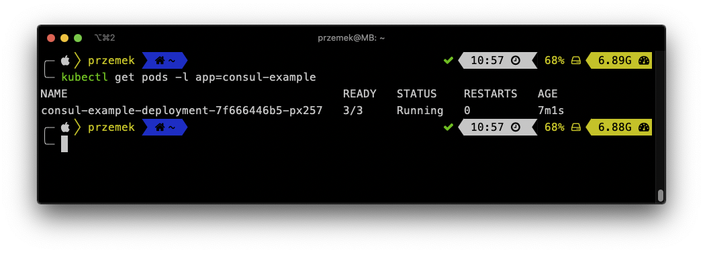

<br><br>
<br><br>
<br><br>

# Installing Consul connect

## LAB Overview

#### In this lab you will install Consul Connect

## Task 1: Getting the last version

1. Determine the latest version of the Consul Helm chart by visiting

[https://github.com/hashicorp/consul-helm/releases](https://github.com/hashicorp/consul-helm/releases)

2. Close the very last version
```
git clone --single-branch --branch v0.20.1 https://github.com/hashicorp/consul-helm.git
```
3. Ensure you've checked out the correct version with ``helm inspect chart ./consul-helm``

## Task 2. Consul installation

1. Install the consul using following command:
```
helm install hashicorp ./consul-helm
```
2. Check the installation
```
helm get all hashicorp
```
3. Look for Consul services
```
kubectl get svc
```

4. Enable port forwarding using following command:
```
kubectl port-forward service/hashicorp-consul-server 8500:8500
```
5. Using any browser of your choice navigate to ``localhost:8500``
6. Now, you should be able to play with Consul dashboard


## Task 3: Enabling automatic sidecars injection

1. Look into [deployment file](files/1_depl.yaml)
There is an annotation:
```
annotations:
        "consul.hashicorp.com/connect-inject": "true"
```
2. Make a deployment by executing:
```
kubectl apply -f 1_depl.yaml
```
3. Get the deployment pods by executing:
```
kubectl get pods -l app=consul-example
```
As you can see, there is only one container inside the pod. Automatin injection did not work.

4. Delete the deployment:
```
kubectl delete -f 1_depl.yaml
```

5. Open Consul configuration file (values.yaml)
6. Edit *connectInject* setting. Set *enable* it to *true*.
7. Save the file and execute:
```
helm upgrade hashicorp ./consul-helm
```
8. Get all services by:
```
kubectl get svc
```
Now you should have additional service

9. Redeploy by:
```
kubectl apply -f 1_depl.yaml
```
10. Check if there are containers injected into the pod by executing:
```
kubectl get pods -l app=consul-example
```

You can also examine the pod using:
```
kubectl describe pod POD_NAME
```
11. Enable port forwarding once again by executing:
```
kubectl port-forward service/hashicorp-consul-server 8500:8500
```
and navigate to *localhost:8500*
## END LAB

<br><br>

<center><p>&copy; 2019 Chmurowisko Sp. z o.o.<p></center>
