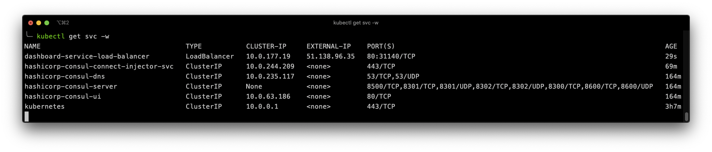
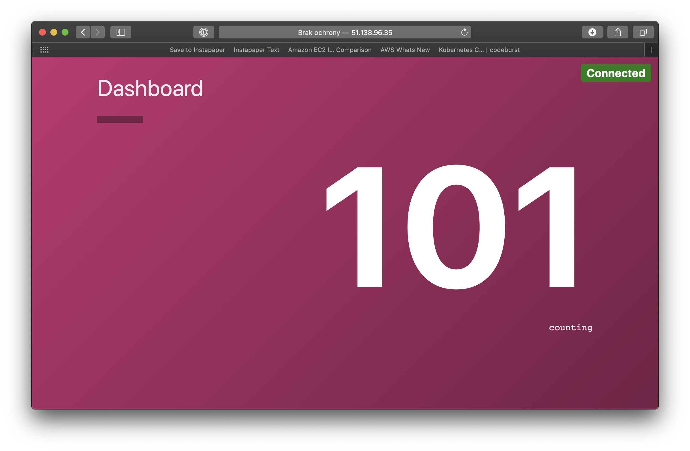

<br><br>
<br><br>
<br><br>

# Working with services

## LAB Overview

#### In this lab you will work with sevices. You'll deploy your services as a two-tier application made of a backend data service that returns a number (the counting service) and a frontend dashboard that pulls from the counting service over HTTP and displays the number.

## Task 1: Deploying counting service

1. Deploy the first service by executing:
```
kubectl apply -f 1_counting_service.yaml
```
2. When the pod is ready, examine if it's working. First get to pod IP address:
```
kubectl get pods -o wide
```
3. Run a debug pod with following command:
```
kubectl run curl --image=radial/busyboxplus:curl -it --rm
```
4. When the pod starts, you'll be inside of it. Let's try to connect to counting pod
```
curl COUNTING-POD-IP:9001
```
Everytime you execute the command, the count number should return the total number of requests.

5. Exit the pod by
```
exit
```

## Task 2: Deploying *Dashboard* service
1. Deploy the dashboard service using following command:
```
kubectl apply -f 2_dashboard.yaml
```
2. Execute 
```
kubectl get svc -w
```
and wait for your load balancer external IP address.


3. Using any browser navigate to load balancer's IP address


## Task 3: Using deployments
1. Deploy a new service using following command:
```
kubectl apply -f 3_service.yaml
```
2. Now you have 3 pods working as a service and one additional pod for debugging. Execute
```
kubectl get pods -l task=consul
```
3. Connect to the *nettools* pod using:
```
kubectl exec nettools -it -c tools -- sh
```
4. Check local environmental viariables
```
env
```
You should see lots of envs.
5. Look for envs describing your service 
```
env | grep SRV1
```
6. Try connecting to the service several times using:
```
curl 127.0.0.1:5000
```
You should get different resnponses. Consul loada balances your requests to all pods.
7. Exit the pod
```
exit
```
8. Delete your deployments using following command:
```
kubectl delete -f 1_counting_service.yaml
kubectl delete -f 2_dashboard.yaml
kubectl delete -f 3_service.yaml
```

## END LAB

<br><br>

<center><p>&copy; 2019 Chmurowisko Sp. z o.o.<p></center>
