<br><br>
<br><br>
<br><br>

# Pods scheduling 

## LAB Overview

#### In this lab you will look into pods scheduling 

Please prepare a cluster with 4 worker nodes.

## Task 1: Taint your nodes

1. Get a list of your nodes by executing:
```
kubectl get nodes
```
2. Taint your nodes using following expressions:
```
kubectl taint nodes <first-node-name> color=red:NoSchedule
kubectl taint nodes <second-node-name> color=blue:NoSchedule
kubectl taint nodes <third-node-name> color=green:NoSchedule
```
3. Describe one of your tainted nodes by executing:
```
kubectl describe node <nodename>
```
You should have a result similiar to that shown below:


## Task 2: Deploying the application with no tolerations

1. Deploy the app by executing:
```
kubectl apply -f files/1_deployment.yaml
```
2. Get the list of pods:
```
kubectl get pods -o wide
```
There should be not pod on nodes 1, 2 and 3. Delete the deployment:
```
kubectl delete -f files/1_deployment.yaml
```

## Task 3: Deploying the app using toleration

1. Deploy an app that tolerates *red* taint:
```
kubectl apply -f files/2_deployment.yaml
```
2. Get the list of pods by:
```
kubectl get pods -o wide
```
The pods should be spread across all but green and blue nodes
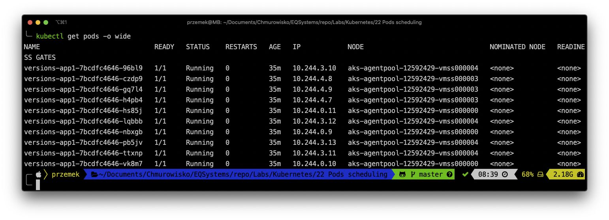
3. Delete the deployment
```
kubectl delete -f files/2_deployment.yaml
```
4. Deploy the app that tolerates existing of the key
```
kubectl apply -f files/3_deployment.yaml
```
5. Get the list of your pods once again:
```
kubectl get pods -o wide
```

Now the pods should be spread across all nodes.
6. Taint your first node with *NoExecute* taint:
```
kubectl taint node  <first-node-name> key=stop:NoExecute
```
Now, the pods deployed to that node should be terminated:
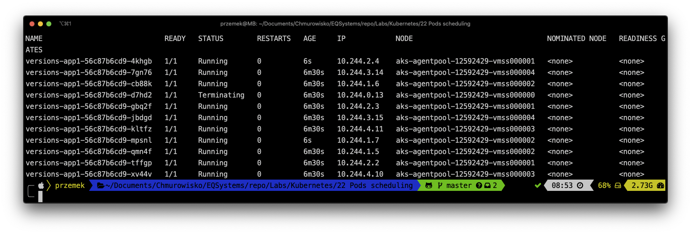
7. Remove tha last taint by:
```
kubectl taint node  <first-node-name> key=stop:NoExecute-
```
8. Remove all taints by executing:
```
kubectl taint nodes <first-node-name> color=red:NoSchedule-
kubectl taint nodes <second-node-name> color=blue:NoSchedule-
kubectl taint nodes <third-node-name> color=green:NoSchedule-
```
## Task 4: Working with node anti affinities

1. Look into built-in node labels
```
kubectl describe node <nodename>
```
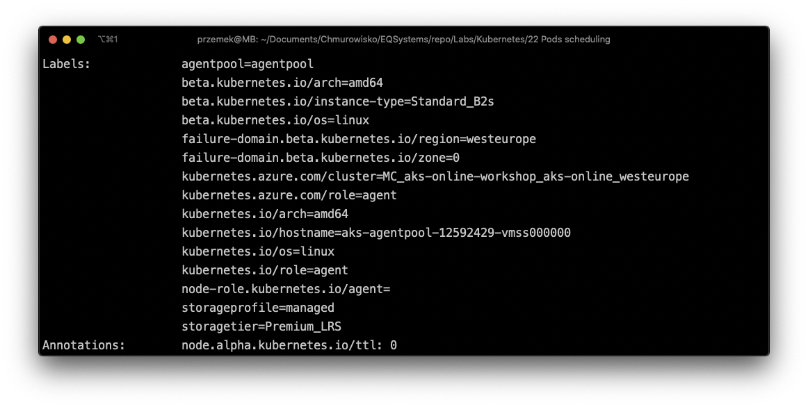
## END LAB
2. Add a label to first two nodes:
```
kubectl label nodes <first-node-name> <second-node-name> webzone=zone1
```
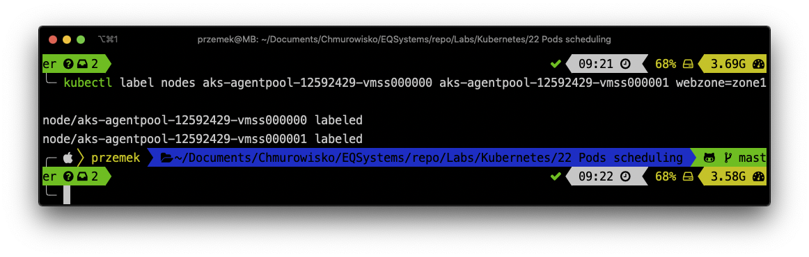
3. Get the node list tieh labels
```
kubectl get nodes --show-labels | grep webzone
```
4. Deploy the pods to webzone 1 by executing:
```
kubectl apply -f files/4_deployment.yaml
```
5. Get the list of pods
```
kubectl get pods -o wide
```
The pods should be deployed to first two nodes
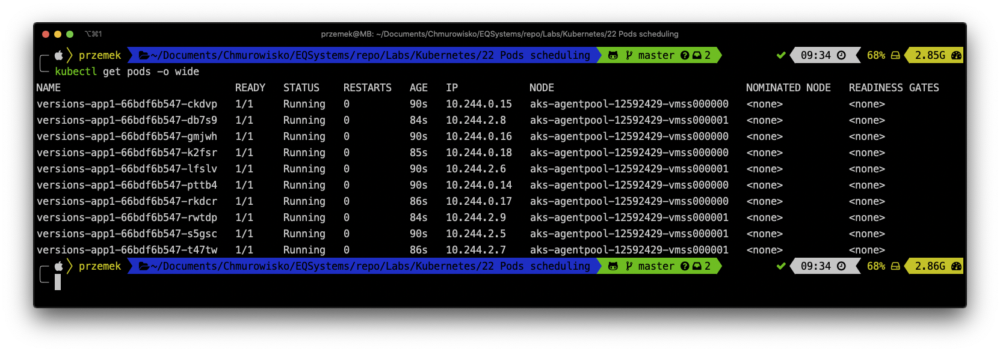
6. Delete the deployment
```
kubectl delete -f files/4_deployment.yaml
```

Lets assume, you want to deploy your solution to *webzone1*, preferrably to a fast machine :-)

7. Add one more label to your first node by:
```
kubectl label nodes <first-node-name> fast=yes
```
Now the node is described as a fast one.
8. Deploy the pods onde again:
```
kubectl apply -f files/5_deployment.yaml
```
9. Get the list of pods:
```
kubectl get pods -o wide
```
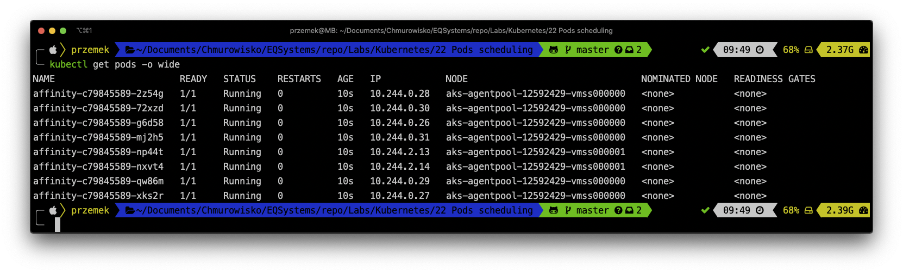
10. Delete node labels by executing:
```
kubectl label nodes <first-node-name> fast-
kubectl label nodes <first-node-name> <second-node-name> webzone-
```
## Task 5: Working with pod anti affinities

1. Deploy redis by executing:
```
kubectl apply -f files/6_deployment.yaml
```
2. Get the list of pods by:
```
kubectl get pods -o wide
```
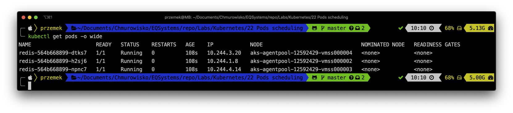

3. Scale the deployment to 4 replicas by:
```
kubectl scale deploy redis --replicas=4
```
4. The pod should be deployed to the next node
```
kubectl get pods -o wide
```
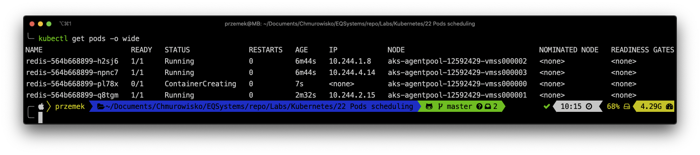
5. Try scaling the deployment once again
```
kubectl scale deploy redis --replicas=6
```
and get the list of pods
```
kubectl get pods -o wide
```
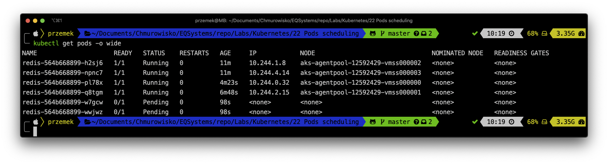
6. Examine one of the pending pods by:
```
kubectl describe pod <podname>
```
Scroll down to events

7. Scale down the deployment:
kubectl scale deploy redis --replicas=2

Let's assume we want to deploy *nginf* but we do not want to deploy it to the same nodes that contain *redis*

8. Deploy *nginx* by executing:
```
kubectl apply -f files/7_deployment.yaml
```
9. Get the list of pods:
```
kubectl get pods -o wide
```
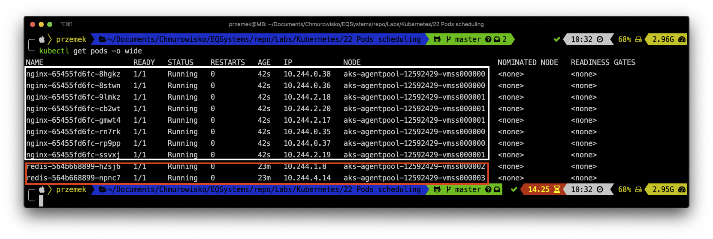
Look into nodes.
10. Delete nginx deployment by:
```
kubectl delete -f files/7_deployment.yaml
```
Now you should have two pods runnung redis on two nodes and two nodes without any deployments.

## Task 6: Working with pod affinities

1. Let's deploy *nginx* once again. But, this time, we want to deploy it as close as possible to Redis instances
```
kubectl apply -f files/8_deployment.yaml
```
2. Get the list of pods
```
kubectl get pods -o wide
```
Now, all pods should work together on two nodes
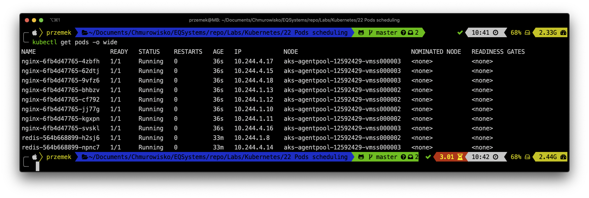

<br><br>

<center><p>&copy; 2019 Chmurowisko Sp. z o.o.<p></center>
