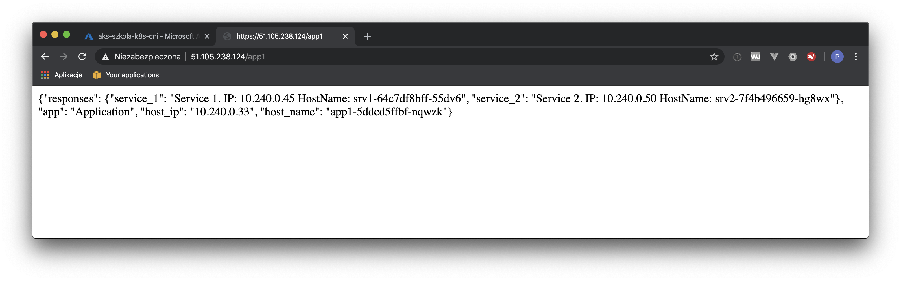

<br><br>
<br><br>
<br><br>

# Network Policies

## LAB Overview

#### Lab description.....

## Task 1: Deploying the application

1. Deploy *ingress controller* iy you do not have it by executing following command:
```
kubectl apply -f 1_ingress_nginx.yaml 
```
2. Create a namespace for the deployment
```
kubectl create ns srv
```
3. Deploy the application
```
kubectl apply -f 2_deployments.md
```
4. Find your *ingress* external address by executing:
```
kubectl get svc --all-namespaces | grep LoadBalancer
```
5. Using any browser of your choice check if the app works. Open following urls:
```
<YOUR INGRESS IP ADDRESS>/app1
<YOUR INGRESS IP ADDRESS>/srv1
<YOUR INGRESS IP ADDRESS>/srv2
```


## Task 2: Applying network policies

1. 
```
kubectl apply -f 3_deny_all_ingress.yaml -n srv
```

## END LAB

<br><br>

<center><p>&copy; 2019 Chmurowisko Sp. z o.o.<p></center>
